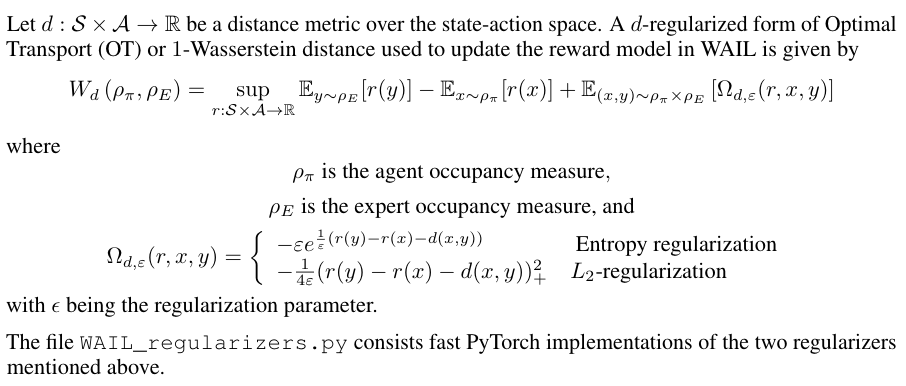
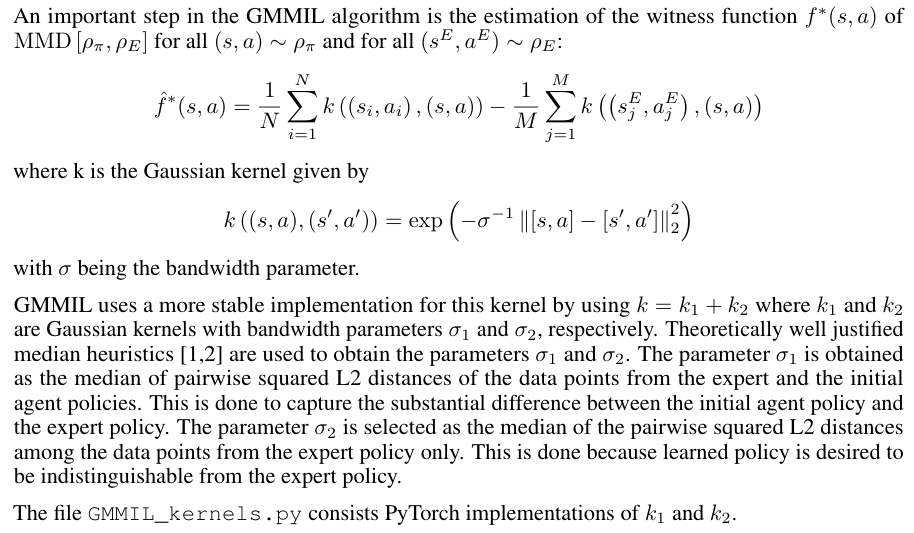

# PyTorch implementation of functions from WAIL and GMMIL
This repository consists of fast implmentations of 
1. The Gaussian kernel used in [GMMIL](http://ailab.kaist.ac.kr/papers/pdfs/KP2018.pdf) 
2. The L2 and entropy regularizers used in [WAIL](https://arxiv.org/pdf/1906.08113.pdf)

## Pre-requisites
- [PyTorch](https://pytorch.org/get-started/previous-versions/#v120) (The code is tested on PyTorch 1.2.0.) 

## Technical Details on WAIL

## Technical Details on GMMIL

### References 
1. Smola, A.; Gretton, A.; Song, L.; and Scholkopf, B. 2007. [A Hilbert space embedding for distributions](http://www.gatsby.ucl.ac.uk/~gretton/papers/SmoGreSonSch07.pdf). In International Conference on Algorithmic Learning Theory. Springer. 
2. Ramdas, A.; Reddi, S. J.; Poczos, B.; Singh, A.; and Wasserman, L. A. 2015. [On the decreasing power of kernel and distance based nonparametric hypothesis tests in high dimensions](https://dl.acm.org/doi/10.5555/2888116.2888212). In Proceedings of the 29th AAAI Conference on Artificial Intelligence.